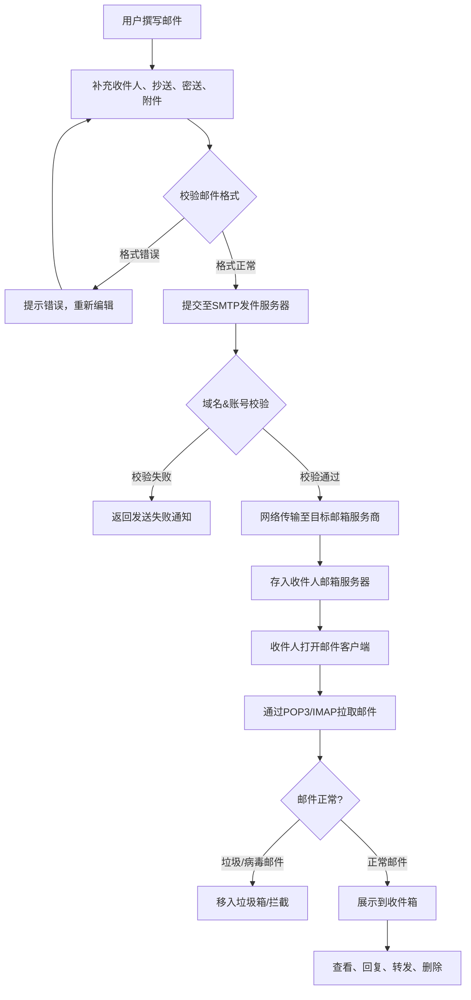

```mermaid
flowchart TD
    1[用户撰写邮件] --> 2[补充收件人、抄送、密送、附件]
    2 --> 3{校验邮件格式}
    3 -->|格式错误| 4[提示错误，重新编辑]
    4 --> 2
    3 -->|格式正常| 5[提交至SMTP发件服务器]
    5 --> 6{域名&账号校验}
    6 -->|校验失败| 7[返回发送失败通知]
    6 -->|校验通过| 8[网络传输至目标邮箱服务商]
    8 --> 9[存入收件人邮箱服务器]
    9 --> 10[收件人打开邮件客户端]
    10 --> 11[通过POP3/IMAP拉取邮件]
    11 --> 12{邮件正常?}
    12 -->|垃圾/病毒邮件| 13[移入垃圾箱/拦截]
    12 -->|正常邮件| 14[展示到收件箱]
    14 --> 15[查看、回复、转发、删除]
```